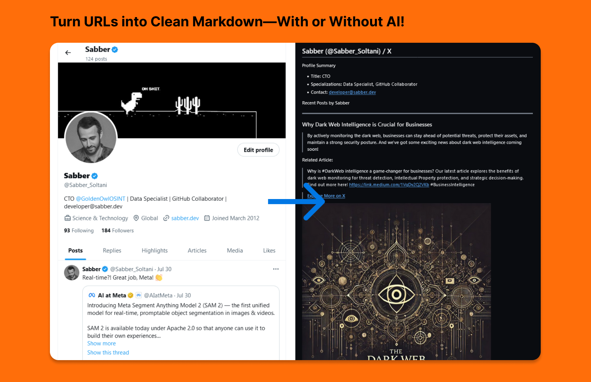

<div align="center">
  <h1 align="center"><strong>NetExtract</strong></h1>
  <p>NetExtract is a robust Node.js backend application designed to extract core content from webpages and transform it into clean, LLM-friendly text. Utilizing Express.js, TypeScript, and Puppeteer, NetExtract offers a streamlined API for content extraction and transformation, making it an ideal tool for enhancing LLM and RAG systems with the latest web information.</p>
</div>



## Features

1. Core Content Extraction: Extracts the essential content from any URL.
2. Markdown Conversion: Transforms webpage content into clean, formatted Markdown.
3. Social Media Scraping: Scrape and format X (Twitter) posts.
4. Simple API Integration: Easy to integrate into any system.
5. LLM-Friendly Output: Provides output optimized for large language models, improving factuality and reducing hallucinations.

## 📖Usage

To use NetExtract, prepend the API endpoint to your desired URL:

```bash
http://{your_address}/api/web?url={url}
```

For scraping Twitter data with Gemma 2:

```bash
http://{your_address}/api/x?url={url}
```

For scraping Google Images:

```bash
http://{your_address}/api/image?q={query}
```

## 🗂️ Getting started

1. Generate an API Key: Get your API key from **[Groq](https://console.groq.com/keys)**

2. **Set Up Twitter Cookies**:

   - Download **[cookie-editor](https://cookie-editor.com/#download)** based on your browser.
   - Log into your Twitter account and download the cookies using this extension.
   - Import the cookies into the `cookie/twitter.json` file. Ensure that all `"sameSite"` values are set to `"Lax"`.
   - **Important**: For security, avoid using your main Twitter account.

3. Configure Environment Variables: Rename env.example to .env and fill in the necessary parameters.

### Recommended Setup with Docker

```bash
git clone https://github.com/sabber-slt/NetExtract
cd NetExtract
```

Then run the application with Docker:

```bash
docker compose up -d
```

## ⚡️ Acknowledgments

- Inspired by jina.ai
- Built with Node.js, Express.js, TypeScript, and Puppeteer

## 🧩 Structure

```
.
├── cookie
│   └── twitter.json            # Twitter cookie for X (Twitter) post scraping
├── docs                        # Documentation files
├── search                      # Searxng engine
├── src                         # Source code
│   ├── interfaces              # TypeScript interfaces
│   ├── lib                     # Utility libraries
│   ├── routes                  # Express route handlers
│   ├── services                # Core service layer for business logic
│   ├── utils                   # Helper functions and utilities
│   └── app.ts                  # Main application entry point
├── .env                        # Environment variables
├── .gitignore                  # Git ignored files
├── .prettierignore             # Prettier ignored files
├── .prettierrc.js              # Prettier configuration
├── app.log                     # Log file
├── Dockerfile                  # Dockerfile
├── docker-compose.yaml         # Docker Compose configuration
├── package.json                # Node.js project metadata
├── README.md                   # Project README
├── tsconfig.json               # TypeScript configuration
└── yarn.lock                   # Yarn lockfile for dependency management

```

## 🤝 Contributing

I welcome and appreciate contributions! If you'd like to contribute, please feel free to submit issues, fork the repository, and send pull requests.
